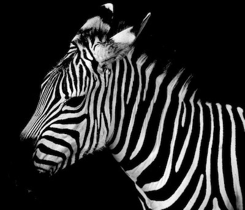
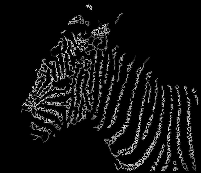

# Fast image to network generator

C++ implementation of a network converter from JPG images.

 



[Other examples](http://edwardlaurence.me/portfolio/1993/01/11/facenetwork.html)

## Usage

### Compilation

The two required packages are `boost::program_options` and `CImg`.

```
cd build
cmake ../src
make
```

`CImg` can be tricky to import with `cmake` depending on your machine. The current `CMakeLists.txt` has been tested on MacOSX 10.13.1. You may need to install the following packages:

```
apt-get install cmake libx11-dev libjpeg-dev cimg-dev gnuplot
```

`CImg` can be tricky to import with `cmake` depending on your machine. The current `CMakeLists.txt` has been tested on MacOSX 10.13.1. You may need to install the following packages


### Creating networks

After compiling, the executable `GRGImage` should have been created in the `build` folder. The parameters are passed using `boost::program_options` so you can do

```
./GRGImage --help
```

to obtain a complete list of the parameters.

**List of parameters**

| Flag        | Type  | Description  |
| ---------- |:-------------:| :-----|
| --imagePath (-i)     | String | Path to the JPG image |
| --outputPath (-o)    | String | Path to dump the output data (add prefix of data output) |
| --number_nodes (-N) | Int | Number of nodes in the resulting network|
| --degree (-d) | Int | Maximum degree of a node (usually 3 or 4)|
| --constrast | Float | Contrast parameter between -infinity to infinity |
| --neigh (-n) | Int | maximum number of neighbor pixels that a node can connect to (for faster convergence) |
| --help || Show the parameters list|
|--transform | | Required to transform the network |
|--displayGray | | Not implemented |
|--CSV | | Output the data in CSV format |
|--GNU | | Output the data in a Gnuplot compatible format |


### Example 

Examples have been made available in the `examples` folder. 

For the glasses example, we run: 

```
../build/GRGImage -i ./images/glasses.jpg -o ./data/glasses -N 1000 -d 3 --contrast 3.7 --transform --CSV --GNU
```

1000 nodes are enough to get a sharp image. 


### Plotting

A Gnuplot script does the plotting for us. In the past, I used matplotlib but it was very slow (2-3 minutes for plotting). I also used a `d3.js` script to show the images in the browser that I could release if requested.

The Gnuplot script takes some parameters

| Params        | Type  | Description  |
| ---------- |:-------------:| :-----|
| dat   | String | Path to the dat file|
| o | String | Output path of the image (do not include the extension) |
|w | Int | Width of the original image (written on the dat file) |
|h| Int | Height of the original image (written on the dat file) |
|r | Float | The ratio between the output size and the original size |
|png| Int | If png=1, the image will be png|
|pdf| Int | If pdf=1, the image will be pdf|
|lw | Float | Linewidth of the edges |

An example is

```
gnuplot -e "dat='./data/glasses_width1200_height748.dat'; o='./networks/glasses';w=1200;h=748;r=1;png=1;lw=1.8" ../src/GNU_plot.gpi
```


